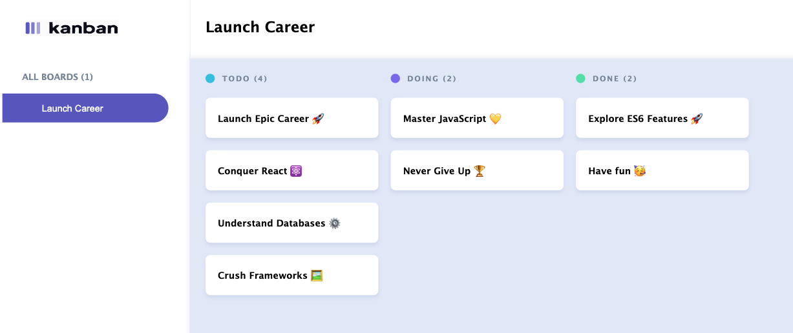

# Kanban Board UI

## 💡 Overview

This project is a **responsive and visually accurate Kanban board** built directly from the provided **Figma design**.  
It features multiple columns, task cards, and a static sidebar, all styled with a consistent theme to ensure a **professional and polished user experience**.

**Figma Design:** https://www.figma.com/design/y7bFCUYL5ZHfPeojACBXg2/Challenge-1-%7C-JSL?node-id=0-1&t=yngAIXXKnJfH7Jj3-1

---

## 🚀 Features & Objectives

- Added a **favicon and page title** that match the project’s branding.  
- Built a **Kanban board with multiple columns** (e.g., *To Do*, *Doing*, *Done*) exactly as in the Figma design.  
- Matched the **layout, colors, typography, and spacing** from the Figma file for pixel-perfect accuracy.  
- Ensured the app is **fully responsive** across laptops, tablets, and mobile devices.  
- Displayed **tasks as individual cards**, following the Figma styling for shadows, padding, and borders.  
- Added **titles to all task cards** for clear descriptions.  
- Implemented a **static sidebar** with the correct icons, labels, and branding elements.  

## 📱 Mobile View

## Tablet View

## 💻 Desktop View

---

## ⛏️ Tech Stack

---

## 👩‍🏫Setup and Running Instructions

Follow these steps to get the project running on your local machine:

### 1. Clone the Repository
First, clone the repo from GitHub

## 2. Navigate into the Project
Move into the project folder

## 3. Open in VS Code (or editor of choice)
If you’re using Visual Studio Code, open the project with:
code .

---

## 🎯 Expected Outcome

The final application delivers a **visually cohesive, user-friendly, and responsive Kanban board** that matches the provided Figma design.  
It provides **consistent styling, intuitive task organization, and a polished look** across all devices.

